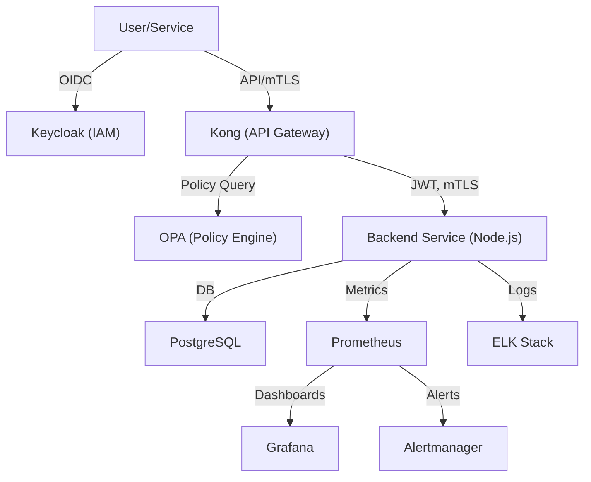

# Zero Trust Architecture – Codebase Overview

A practical guide for onboarding and quick reference to the Zero Trust codebase, including architecture, directory structure, service interactions, and getting started.

> **📖 For detailed architectural analysis and design decisions, see [ARCHITECTURE_DEEP_DIVE.md](./ARCHITECTURE_DEEP_DIVE.md)**

---

## Table of Contents
- [1. Quick Start](#1-quick-start)
- [2. Architecture Overview](#2-architecture-overview)
- [3. Directory Structure](#3-directory-structure)
- [4. Component Integration](#4-component-integration)
- [5. Service Deep-Dives](#5-service-deep-dives)
- [6. Security & Observability](#6-security--observability)
- [7. Deployment & Development](#7-deployment--development)
- [8. Extending the System](#8-extending-the-system)
- [9. Onboarding & Contribution](#9-onboarding--contribution)
- [10. References](#10-references)

---

## 1. Quick Start

### Prerequisites
- Docker and Docker Compose
- Node.js 18+ (for local development)
- OpenSSL (for certificate generation)

### Deploy in 3 Steps
```bash
# 1. Setup networks, certs, and secrets
./scripts/setup.sh

# 2. Deploy the stack
./scripts/deploy.sh

# 3. For frontend hot-reload dev mode
./scripts/deploy-dev.sh
```

### Access Services
- **Frontend**: https://localhost:8080
- **Keycloak Admin**: http://localhost:8080 (admin/admin)
- **API Gateway**: https://localhost:8443
- **Grafana**: http://localhost:3001 (admin/admin)
- **Prometheus**: http://localhost:9090

---

## 2. Architecture Overview

This Zero Trust implementation demonstrates a modern Zero Trust stack for hybrid cloud environments. It enforces strict identity, policy, and network controls, and provides full observability.

### High-Level Diagram


> **🏗️ For detailed architectural analysis, see [Section 4: Component Architecture](./ARCHITECTURE_DEEP_DIVE.md#4-component-architecture) in the Deep Dive**

---

## 3. Directory Structure

```
/
├── docker-compose.yml                  # Main Compose file (all core services)
├── docker-compose.frontend-dev.yml     # Dev override for frontend
├── docker-compose.render.yml           # Render.com deployment config
├── docker-compose.secrets.yml          # Compose file for secrets
├── networks/                           # Custom Docker network definitions
│   ├── cloud-net.yml
│   └── onprem-net.yml
├── secrets/                            # Secret files (auto-generated, gitignored)
│   ├── db_user.txt
│   ├── db_password.txt
│   ├── postgres_user.txt
│   ├── postgres_password.txt
│   └── keycloak_admin_password.txt
├── services/
│   ├── backend-service/                # Node.js backend (API, DB, metrics, logging)
│   ├── frontend-app/                   # React frontend (SPA)
│   └── api-gateway/                    # Kong config, plugins, etc.
├── monitoring/                         # Monitoring and alerting configs
│   ├── prometheus.yml
│   ├── alerts.yml
│   ├── alertmanager.yml
│   ├── grafana-dashboard.json
│   ├── grafana-dashboard-security.json
│   └── ...
├── policies/                           # OPA policy bundles
├── scripts/                            # Automation scripts (deploy, setup, etc.)
│   ├── lib/                            # Shared script libraries
│   │   ├── common.sh                   # Common deployment functions
│   │   └── test-helpers.sh             # Common test functions
│   ├── deploy.sh                       # Production deployment
│   ├── deploy-dev.sh                   # Development deployment
│   └── test-*.sh                       # Test scripts
├── certs/                              # mTLS certificates (auto-generated)
├── README.md                           # Project overview and quickstart
├── ARCHITECTURE_DEEP_DIVE.md           # Detailed architectural analysis
└── implementation_guide.md             # Step-by-step implementation guide
```

---

## 4. Component Integration

### Authentication & Authorization
- **Keycloak** issues JWTs after OIDC login. All API requests must present a valid JWT.
- **Kong** validates JWTs, enforces mTLS, and applies rate limiting.
- **OPA** is queried by Kong and the backend for policy decisions (e.g., can user X access resource Y?).
- **Backend** verifies JWTs, enforces RBAC, and queries OPA for fine-grained authorization.

### Data Flow
- **User/Service** → **Kong** (API Gateway) → **Backend** → **PostgreSQL**
- **Kong** and **Backend** both consult **OPA** for policy enforcement.
- **Backend** emits logs (to ELK) and metrics (to Prometheus).

### Observability
- **Prometheus** scrapes metrics from backend, node exporter, and other services.
- **Grafana** visualizes metrics and dashboards.
- **Alertmanager** sends alerts based on Prometheus rules.
- **ELK Stack** aggregates logs from all services for search and analysis.

> **🔍 For detailed integration patterns, see [Section 6: Integration Patterns](./ARCHITECTURE_DEEP_DIVE.md#6-integration-patterns) in the Deep Dive**

---

## 5. Service Deep-Dives

### 5.1 Keycloak (Identity & Access Management)
- **Purpose:** Centralized authentication, user management, and RBAC.
- **Integration:**
  - Issues JWTs for users/services.
  - Kong and backend validate these JWTs.
  - Admin UI: http://localhost:8080 (default: admin/admin)
- **Customization:**
  - Realms, clients, and roles can be managed via the admin UI or REST API.

### 5.2 OPA (Policy Enforcement)
- **Purpose:** Fine-grained, dynamic authorization using Rego policies.
- **Integration:**
  - Kong and backend query OPA for allow/deny decisions.
  - Policies are stored in `policies/` and hot-reloaded.
- **Example:**
  - A policy might allow only users with the `admin` role to access certain endpoints.

### 5.3 Kong (API Gateway)
- **Purpose:** Entry point for all API traffic, enforcing mTLS, JWT validation, and rate limiting.
- **Integration:**
  - Validates JWTs from Keycloak.
  - Enforces mTLS between clients and gateway.
  - Queries OPA for policy decisions before routing requests.
  - Logs traffic and metrics.
- **Customization:**
  - Plugins and routes are configured in `services/api-gateway/gateway-config.yaml`.

### 5.4 Backend Service
- **Tech:** Node.js (Express), Sequelize ORM, PostgreSQL.
- **Features:**
  - CRUD endpoints, input validation, auditing, Prometheus metrics, OpenAPI docs, security headers, rate limiting, CORS, structured logging, request tracing.
- **Integration:**
  - Receives requests from Kong, verifies JWT, enforces RBAC, queries OPA.
  - Persists data in PostgreSQL.
  - Emits logs to ELK and metrics to Prometheus.
- **Customization:**
  - Business logic, models, and API routes in `services/backend-service/`.

### 5.5 PostgreSQL (Database)
- **Purpose:** Persistent storage for backend service.
- **Integration:**
  - Managed via Docker Compose.
  - Credentials injected via Docker secrets.
  - Data volume for persistence.

### 5.6 Monitoring & Observability
- **Prometheus:** Scrapes metrics from backend and infrastructure.
- **Grafana:** Visualizes metrics and dashboards.
- **Alertmanager:** Sends alerts based on Prometheus rules.
- **ELK Stack:** Aggregates and indexes logs from all services.
- **Node Exporter:** Collects host-level metrics.

> **🔧 For detailed service architecture, see [Section 4: Component Architecture](./ARCHITECTURE_DEEP_DIVE.md#4-component-architecture) in the Deep Dive**

---

## 6. Security & Observability

- **mTLS:** All service-to-service traffic is encrypted and authenticated.
- **JWT Authentication:** All API calls require valid JWTs from Keycloak.
- **RBAC & OPA Policies:** Centralized, auditable, and versioned authorization logic.
- **Rate Limiting:** API Gateway and backend both enforce rate limits.
- **Audit Logging:** All sensitive actions are logged and shipped to ELK.
- **Secrets Management:** All sensitive credentials are injected via Docker secrets, never hardcoded.
- **CORS & Security Headers:** Strict CORS, Helmet, and custom headers in backend.
- **Log Rotation:** Automated log rotation for backend and monitoring components.
- **Dashboards:** Grafana dashboards for infrastructure and security; Kibana for logs.

> **🛡️ For detailed security architecture, see [Section 5: Security Architecture](./ARCHITECTURE_DEEP_DIVE.md#5-security-architecture) in the Deep Dive**

---

## 7. Deployment & Development

### Local Development
```bash
# 1. Setup networks, certs, and secrets
./scripts/setup.sh

# 2. Deploy the stack
./scripts/deploy.sh

# 3. For frontend hot-reload dev mode
./scripts/deploy-dev.sh
```

### Manual Docker Compose
```bash
# Production
docker-compose up -d

# Development (frontend hot reload)
docker-compose -f docker-compose.yml -f docker-compose.frontend-dev.yml up -d
```

### Testing
```bash
# Test full deployment
./scripts/test-deployment.sh

# Test backend features specifically
./scripts/test-backend-features.sh
```

> **🚀 For detailed deployment architecture, see [Section 9: Deployment Architecture](./ARCHITECTURE_DEEP_DIVE.md#9-deployment-architecture) in the Deep Dive**

---

## 8. Extending the System

### Adding New Services
1. Create service directory in `services/`
2. Add Dockerfile and configuration
3. Update `docker-compose.yml`
4. Add monitoring configuration
5. Update OPA policies if needed

### Adding New Policies
1. Create Rego file in `policies/`
2. Test with OPA CLI: `opa test policies/`
3. Deploy and test with real requests

### Adding New Monitoring
1. Configure Prometheus targets
2. Create Grafana dashboards
3. Set up alerting rules

> **🔧 For detailed extension patterns, see [Section 7: Integration Patterns](./ARCHITECTURE_DEEP_DIVE.md#7-integration-patterns) in the Deep Dive**

---

## 9. Onboarding & Contribution

### For New Contributors
1. Read this overview first
2. Review [ARCHITECTURE_DEEP_DIVE.md](./ARCHITECTURE_DEEP_DIVE.md) for technical details
3. Follow [implementation_guide.md](./implementation_guide.md) for step-by-step setup
4. Run tests to verify your environment

### Development Workflow
1. Use `./scripts/deploy-dev.sh` for development
2. Write tests for new features
3. Update documentation as needed
4. Follow security best practices

### Code Organization
- **Scripts**: Use shared libraries in `scripts/lib/`
- **Services**: Keep services modular and focused
- **Policies**: Version control all OPA policies
- **Documentation**: Keep this overview updated for onboarding

---

## 10. References

- [Zero Trust Architecture Principles](https://www.nist.gov/publications/zero-trust-architecture)
- [Keycloak Documentation](https://www.keycloak.org/documentation)
- [OPA Documentation](https://www.openpolicyagent.org/docs/)
- [Kong Documentation](https://docs.konghq.com/)
- [Prometheus Documentation](https://prometheus.io/docs/)

> **📚 For comprehensive architectural references and design decisions, see [ARCHITECTURE_DEEP_DIVE.md](./ARCHITECTURE_DEEP_DIVE.md)**

---

**For any questions, contributions, or issues, please refer to the README or open an issue in the repository.** 