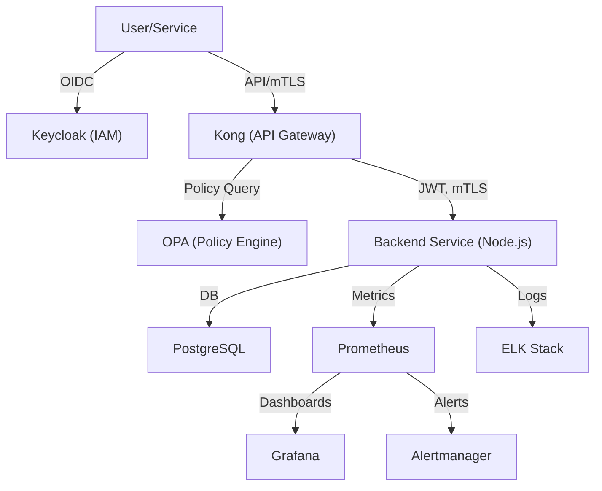

# Zero Trust Architecture PoC – Codebase Overview

A detailed breakdown of the Zero Trust PoC codebase, including architecture, directory structure, service interactions, and onboarding notes.

---

## Table of Contents
- [1. Architecture](#1-architecture)
- [2. Directory Structure](#2-directory-structure)
- [3. Component Integration](#3-component-integration)
- [4. Service Deep-Dives](#4-service-deep-dives)
- [5. Security & Observability](#5-security--observability)
- [6. Deployment & Development](#6-deployment--development)
- [7. Extending the System](#7-extending-the-system)
- [8. Onboarding & Contribution](#8-onboarding--contribution)
- [9. References](#9-references)

---

## 1. Architecture

This PoC demonstrates a modern Zero Trust stack for hybrid cloud environments. It enforces strict identity, policy, and network controls, and provides full observability.

### High-Level Diagram


---

## 2. Directory Structure

```
/
├── docker-compose.yml                  # Main Compose file (all core services)
├── docker-compose.frontend-dev.yml     # Dev override for frontend
├── docker-compose.render.yml           # Render.com deployment config
├── docker-compose.secrets.yml          # Compose file for secrets
├── networks/                           # Custom Docker network definitions
│   ├── cloud-net.yml
│   └── onprem-net.yml
├── secrets/                            # Secret files (auto-generated, gitignored)
│   ├── db_user.txt
│   ├── db_password.txt
│   ├── postgres_user.txt
│   ├── postgres_password.txt
│   └── keycloak_admin_password.txt
├── services/
│   ├── backend-service/                # Node.js backend (API, DB, metrics, logging)
│   ├── frontend-app/                   # React frontend (SPA)
│   └── api-gateway/                    # Kong config, plugins, etc.
├── monitoring/                         # Monitoring and alerting configs
│   ├── prometheus.yml
│   ├── alerts.yml
│   ├── alertmanager.yml
│   ├── grafana-dashboard.json
│   ├── grafana-dashboard-security.json
│   └── ...
├── policies/                           # OPA policy bundles
├── scripts/                            # Automation scripts (deploy, setup, etc.)
├── certs/                              # mTLS certificates (auto-generated)
├── README.md                           # Project overview and quickstart
├── implementation_guide.md             # Step-by-step implementation guide
└── ...                                 # Other docs, configs, and CI/CD files
```

---

## 3. Component Integration

### Authentication & Authorization
- **Keycloak** issues JWTs after OIDC login. All API requests must present a valid JWT.
- **Kong** validates JWTs, enforces mTLS, and applies rate limiting.
- **OPA** is queried by Kong and the backend for policy decisions (e.g., can user X access resource Y?).
- **Backend** verifies JWTs, enforces RBAC, and queries OPA for fine-grained authorization.

### Data Flow
- **User/Service** → **Kong** (API Gateway) → **Backend** → **PostgreSQL**
- **Kong** and **Backend** both consult **OPA** for policy enforcement.
- **Backend** emits logs (to ELK) and metrics (to Prometheus).

### Observability
- **Prometheus** scrapes metrics from backend, node exporter, and other services.
- **Grafana** visualizes metrics and dashboards.
- **Alertmanager** sends alerts based on Prometheus rules.
- **ELK Stack** aggregates logs from all services for search and analysis.

---

## 4. Service Deep-Dives

### 4.1 Keycloak (Identity & Access Management)
- **Purpose:** Centralized authentication, user management, and RBAC.
- **Integration:**
  - Issues JWTs for users/services.
  - Kong and backend validate these JWTs.
  - Admin UI: http://localhost:8080 (default: admin/admin)
- **Customization:**
  - Realms, clients, and roles can be managed via the admin UI or REST API.

### 4.2 OPA (Policy Enforcement)
- **Purpose:** Fine-grained, dynamic authorization using Rego policies.
- **Integration:**
  - Kong and backend query OPA for allow/deny decisions.
  - Policies are stored in `policies/` and hot-reloaded.
- **Example:**
  - A policy might allow only users with the `admin` role to access certain endpoints.

### 4.3 Kong (API Gateway)
- **Purpose:** Entry point for all API traffic, enforcing mTLS, JWT validation, and rate limiting.
- **Integration:**
  - Validates JWTs from Keycloak.
  - Enforces mTLS between clients and gateway.
  - Queries OPA for policy decisions before routing requests.
  - Logs traffic and metrics.
- **Customization:**
  - Plugins and routes are configured in `services/api-gateway/gateway-config.yaml`.

### 4.4 Backend Service
- **Tech:** Node.js (Express), Sequelize ORM, PostgreSQL.
- **Features:**
  - CRUD endpoints, input validation, auditing, Prometheus metrics, OpenAPI docs, security headers, rate limiting, CORS, structured logging, request tracing.
- **Integration:**
  - Receives requests from Kong, verifies JWT, enforces RBAC, queries OPA.
  - Persists data in PostgreSQL.
  - Emits logs to ELK and metrics to Prometheus.
- **Customization:**
  - Business logic, models, and API routes in `services/backend-service/`.

### 4.5 PostgreSQL (Database)
- **Purpose:** Persistent storage for backend service.
- **Integration:**
  - Managed via Docker Compose.
  - Credentials injected via Docker secrets.
  - Data volume for persistence.

### 4.6 Monitoring & Observability
- **Prometheus:** Scrapes metrics from backend and infrastructure.
- **Grafana:** Visualizes metrics and dashboards.
- **Alertmanager:** Sends alerts based on Prometheus rules.
- **ELK Stack:** Aggregates and indexes logs from all services.
- **Node Exporter:** Collects host-level metrics.

---

## 5. Security & Observability

- **mTLS:** All service-to-service traffic is encrypted and authenticated.
- **JWT Authentication:** All API calls require valid JWTs from Keycloak.
- **RBAC & OPA Policies:** Centralized, auditable, and versioned authorization logic.
- **Rate Limiting:** API Gateway and backend both enforce rate limits.
- **Audit Logging:** All sensitive actions are logged and shipped to ELK.
- **Secrets Management:** All sensitive credentials are injected via Docker secrets, never hardcoded.
- **CORS & Security Headers:** Strict CORS, Helmet, and custom headers in backend.
- **Log Rotation:** Automated log rotation for backend and monitoring components.
- **Dashboards:** Grafana dashboards for infrastructure and security; Kibana for logs.

---

## 6. Deployment & Development

### Local Development
```bash
# 1. Setup networks, certs, and secrets
./scripts/setup.sh

# 2. Deploy the stack
./scripts/deploy.sh

# 3. For frontend hot-reload dev mode
./scripts/deploy-dev.sh
```

### Manual Docker Compose
```bash
# Production
docker-compose up -d

# Development (frontend hot reload)
docker-compose -f docker-compose.yml -f docker-compose.frontend-dev.yml up -d
```

### Render.com Deployment
- Use `docker-compose.render.yml` for cloud deployment.
- See `RENDER_DEPLOYMENT.md` for details.

---

## 7. Extending the System

- **Add new services:** Extend `docker-compose.yml` and create a new directory under `services/`.
- **Add new policies:** Place Rego files in `policies/` and reload OPA.
- **Add dashboards/alerts:** Place new JSON/YAML files in `monitoring/` and reload Prometheus/Grafana.
- **Add scripts:** Place automation or utility scripts in `scripts/`.
- **CI/CD:** GitHub Actions for build, test, and deploy.

---

## 8. Onboarding & Contribution

- **Getting Started:**
  - Read this file and the [README.md](./README.md).
  - Run the quick start commands above.
  - Explore each service's directory for more details.
- **Best Practices:**
  - Never commit secrets or certificates.
  - Use environment variables for non-sensitive config.
  - Write tests for new features.
  - Document new services, policies, or dashboards.
- **Support:**
  - Open an issue or consult the documentation.

---

## 9. References
- [Implementation Guide](./implementation_guide.md)
- [Monitoring Setup](./monitoring/README.md)
- [Backend API Docs](./services/backend-service/README.md)
- [Policy Reference](./policies/README.md)
- [Render Deployment](./RENDER_DEPLOYMENT.md)

---

**For any questions, contributions, or issues, please refer to the README or open an issue in the repository.** 