# Zero Trust Architecture - System Flowchart

## Overview

This document provides a comprehensive flowchart visualization of the Zero Trust Architecture (ZTA) implementation, showing data flow, security controls, and component interactions.

## Architecture Components

### Core Services

- **Keycloak** (Port 8080): Identity and Access Management
- **Express Gateway** (Port 8000): API Gateway with Zero Trust policies
- **Backend Service** (Port 4000): Business logic and data management
- **PostgreSQL**: Data persistence
- **OPA** (Port 8181): Policy engine for authorization decisions

### Monitoring Stack

- **Prometheus** (Port 9090): Metrics collection and storage
- **Grafana** (Port 3001): Advanced monitoring dashboards
- **AlertManager** (Port 9093): Alert management and notifications
- **Elasticsearch** (Port 9200): Log storage and indexing
- **Kibana** (Port 5601): Log analysis and visualization
- **Logstash** (Port 5044): Log processing and forwarding

### Network Segmentation

- **on-prem-net** (172.18.0.0/16): Sensitive services (Keycloak, OPA, monitoring)
- **cloud-net** (192.168.0.0/16): External-facing services (Backend, Gateway)

## Detailed Flowchart

```mermaid
graph TB
    %% External Users
    User[👤 External User] --> |HTTP Request| Gateway[🚪 Express Gateway<br/>Port 8000]

    %% Network Segmentation
    subgraph "Cloud Network (192.168.0.0/16)"
        Gateway
        Backend[🏢 Backend Service<br/>Port 4000]
        Postgres[(🗄️ PostgreSQL)]
    end

    subgraph "On-Prem Network (172.18.0.0/16)"
        Keycloak[🔐 Keycloak<br/>Port 8080]
        OPA[⚖️ OPA Policy Engine<br/>Port 8181]
        Prometheus[📊 Prometheus<br/>Port 9090]
        Grafana[📈 Grafana<br/>Port 3001]
        AlertManager[🚨 AlertManager<br/>Port 9093]
        Elasticsearch[(🔍 Elasticsearch<br/>Port 9200)]
        Kibana[📋 Kibana<br/>Port 5601]
        Logstash[📝 Logstash<br/>Port 5044]
    end

    %% Authentication Flow
    User --> |1. Login Request| Keycloak
    Keycloak --> |2. JWT Token| User
    User --> |3. API Request + JWT| Gateway

    %% Gateway Processing
    Gateway --> |4. JWT Validation| Keycloak
    Gateway --> |5. Policy Check| OPA
    OPA --> |6. Authorization Decision| Gateway

    %% Backend Access
    Gateway --> |7. Forward Request| Backend
    Backend --> |8. Database Operations| Postgres

    %% Monitoring Flow
    Gateway --> |9. Metrics| Prometheus
    Backend --> |10. Metrics| Prometheus
    Gateway --> |11. Logs| Logstash
    Backend --> |12. Logs| Logstash
    Logstash --> |13. Processed Logs| Elasticsearch
    Prometheus --> |14. Metrics| Grafana
    Elasticsearch --> |15. Logs| Kibana
    Prometheus --> |16. Alerts| AlertManager

    %% Security Controls
    subgraph "Security Controls"
        JWT[JWT Token Validation]
        OPA_Policy[OPA Policy Enforcement]
        RateLimit[Rate Limiting]
        IPFilter[IP Filtering]
        Audit[Audit Logging]
    end

    Gateway -.-> JWT
    Gateway -.-> OPA_Policy
    Gateway -.-> RateLimit
    Gateway -.-> IPFilter
    Gateway -.-> Audit

    %% Styling
    classDef external fill:#e1f5fe
    classDef gateway fill:#fff3e0
    classDef backend fill:#f3e5f5
    classDef security fill:#e8f5e8
    classDef monitoring fill:#fff8e1
    classDef database fill:#fce4ec

    class User external
    class Gateway gateway
    class Backend backend
    class Keycloak,OPA security
    class Prometheus,Grafana,AlertManager,Elasticsearch,Kibana,Logstash monitoring
    class Postgres database
```

## Request Flow Details

### 1. Authentication Flow

### 2. Security Policy Evaluation

### 3. Monitoring and Observability

## Security Controls Implementation

### 1. JWT Token Validation

- **Issuer Verification**: Ensures token is from trusted Keycloak realm
- **Audience Validation**: Checks token audience matches expected values
- **Expiration Check**: Validates token hasn't expired
- **Signature Verification**: Uses JWKS to verify token signature

### 2. OPA Policy Enforcement

- **Role-Based Access**: Enforces user roles (admin, user)
- **Resource-Based Policies**: Controls access to specific endpoints
- **Context-Aware Decisions**: Considers user context and request details

### 3. Network Security

- **Network Segmentation**: Isolates services in different networks
- **IP Filtering**: Whitelist/blacklist IP addresses
- **Rate Limiting**: Prevents abuse and DDoS attacks

### 4. Monitoring and Alerting

- **Real-time Metrics**: Prometheus collects performance and security metrics
- **Security Events**: Comprehensive logging of all security-relevant events
- **Anomaly Detection**: AlertManager triggers alerts for unusual patterns

## Traffic Simulation Flow

## Deployment Architecture

## Key Security Principles Implemented

1. **Never Trust, Always Verify**

   - Every request requires valid JWT token
   - OPA evaluates each request against policies
   - No implicit trust based on network location

2. **Least Privilege Access**

   - Role-based access control
   - Resource-specific permissions
   - Network segmentation

3. **Continuous Monitoring**

   - Real-time metrics collection
   - Security event logging
   - Anomaly detection and alerting

4. **Defense in Depth**
   - Multiple security layers
   - Network isolation
   - Comprehensive logging and monitoring

## Operational Flow

This flowchart provides a comprehensive view of the Zero Trust Architecture implementation, showing how security controls, monitoring, and operational processes work together to create a secure, observable system.
